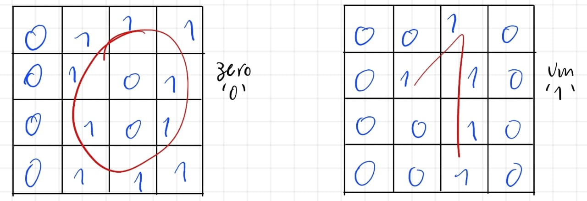

# Multilayer Perceptron ANN

Este projeto implementa uma rede neural Perceptron de múltiplas camadas (_Multilayer Perceptron - MLP_) para identificar dígitos cursivos 0 e 1. Os dígitos são representados em uma matriz 4x4, resultando em 16 pixels binários como entrada para a rede.

## 📁 Estrutura do Repositório

- `mlp.py` - Código principal do projeto, contendo o treinamento e reconhecimento dos dígitos.
- `pesos_oculta.txt` - Arquivo que armazena os pesos treinados da camada oculta.
- `pesos_saida.txt` - Arquivo que armazena os pesos treinados da camada de saída.
- `amostras.txt` - Arquivo contendo exemplos de entrada para treinamento e teste.

## 🚀 Como Executar

### 1️⃣ Clonar o repositório

```bash
$ git clone https://github.com/Heverton-Souza/Multi_Layer-Perceptron-ANN.git

$ cd Multilayer-Perceptron-ANN
```

### 2️⃣ Instalar dependências

Este projeto utiliza a biblioteca `numpy`, que pode ser instalada com:

```bash
$ pip install numpy
```

### 3️⃣ Executar o código

Para iniciar o treinamento ou reconhecer dígitos, basta rodar o script:

```bash
$ python mlp.py
```

O programa apresentará um menu:

1. **Treinar a rede neural** - Permite fornecer amostras e treinar a rede.
2. **Reconhecer um dígito** - Permite inserir uma nova amostra e testar a rede já treinada.
3. **Sair** - Finaliza o programa.

## 🧠 Como Funciona

### 🔹 Entrada de Dados

Cada amostra de treinamento ou teste é uma sequência de 16 valores binários representando uma matriz 4x4. Exemplo de entrada:

```
0 1 1 1 0 1 0 1 0 1 0 1 0 1 1 1 - Zero
0 1 0 0 1 1 0 0 0 1 0 0 1 1 0 0 - Um
```

A rede recebe esses valores como entrada, adicionando um bias.

### 🔹 Estrutura do MLP

Diferente do _Single Layer Perceptron_, este MLP possui uma camada escondida com **1 neurônio**, antes da camada de saída. A estrutura é:

- **Entrada**: 16 neurônios (+1 bias)
- **Camada escondida**: 1 neurônio
- **Camada de saída**: 2 neurônios (um para o dígito "0" e outro para "1")

### 🔹 Função de Ativação

Nesta rede, a ativação das camadas usa a **função sigmoide**, definida como:

```math
f(V) = \frac{1}{1 + e^{-a.V}}
```

onde `a` é a taxa de aprendizado.

### 🔹 Treinamento

O treinamento ocorre ajustando os pesos por meio do **Backpropagation**, minimizando o erro. A condição de parada é diferente do SLP e baseada no erro quadrático médio:

```math
E = \frac{1}{T} \sum_{i=1}^{T} E_i
```

onde `T` é o número total de amostras, e `Ei` é o erro quadrático de cada amostra.

Se `E` for menor que um limite predefinido, o treinamento é encerrado.

### 🔹 Reconhecimento

Após o treinamento, novos dígitos podem ser classificados utilizando os pesos ajustados. O resultado indica se a amostra é reconhecida como `0` ou `1`.

## 📊 Testes e Taxa de Acerto

O arquivo `amostras.txt` contém exemplos usados no treinamento e teste:

- **Primeiras 8 amostras**: usadas no treinamento.
- **Últimas 8 amostras**: usadas para testar a rede após o treinamento.

Nos testes realizados com as 8 amostras que não foram usadas no treinamento, a rede acertou **8 de 8**, resultando em uma taxa de acerto de **100%**.

Este resultado é significativamente superior ao do _Single Layer Perceptron_, alcançado apenas com a adição de **uma única camada escondida com apenas um neurônio**.

## 📷 Visualizando os Dígitos

Para facilitar a compreensão, abaixo está um exemplo visual das representações dos dígitos nas matrizes 4x4:


